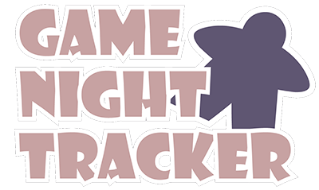
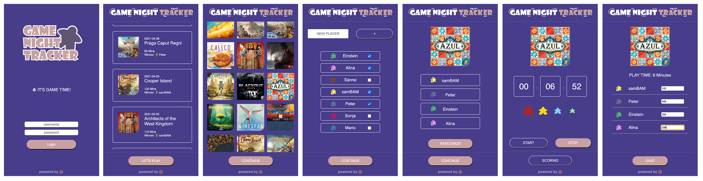
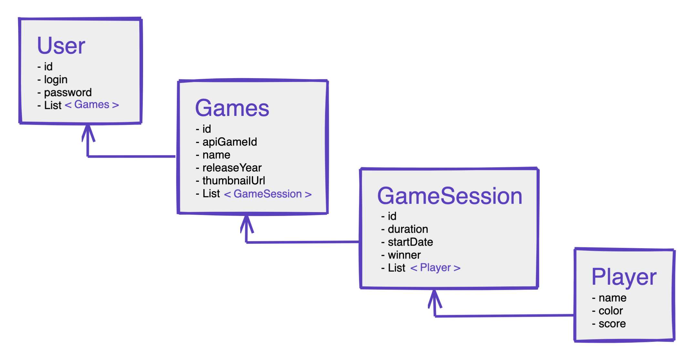

# GAME NIGHT TRACKER

Everything a modern board gamer needs besides games and players.

---

For my first web application coded from scratch, i had to go for something that i feel could be useful to many gamers  
around the globe. Modern board gamers love to track their game nights and log e.g. their scores and play time, over the
course of their gaming "career" - which usually does not end for a couple years, if you get bitten by the board game
bug. Many people even take it as a challenge and get motivated to play even more to improve their stats. And while there
are already a few apps out there, i have been missing the **all-in-one solution** - one that follows the flow of the
typical game session... what, who, how long, results.

## Features

- User Login (using JWT)
- Automatic loading of existing sessions, games and players from database
- Adding new players with a randomized color property
- Animated randomizer for player order
- Timer for game duration including little animation
- Save action will automatically render the session on the first page
  [status after 4 weeks]

## Data Model

All data are connected to the logged-in user, who is stored in a MongoDB. This has resulted in an user object with lots
of nested data, which was a big challenge to handle properly.

## Outlook

This application has a lot more in the works to improve the experience.

- API call to public boardgame database to automatically add a new game to session
- Output of different stats like total play time, win rates, high scores,...
- Ultimately, a native app which can be downloaded to your mobile device

Thanks for stopping by! (^_^)b